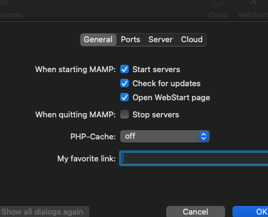
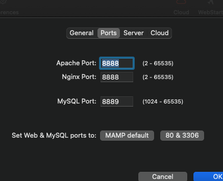
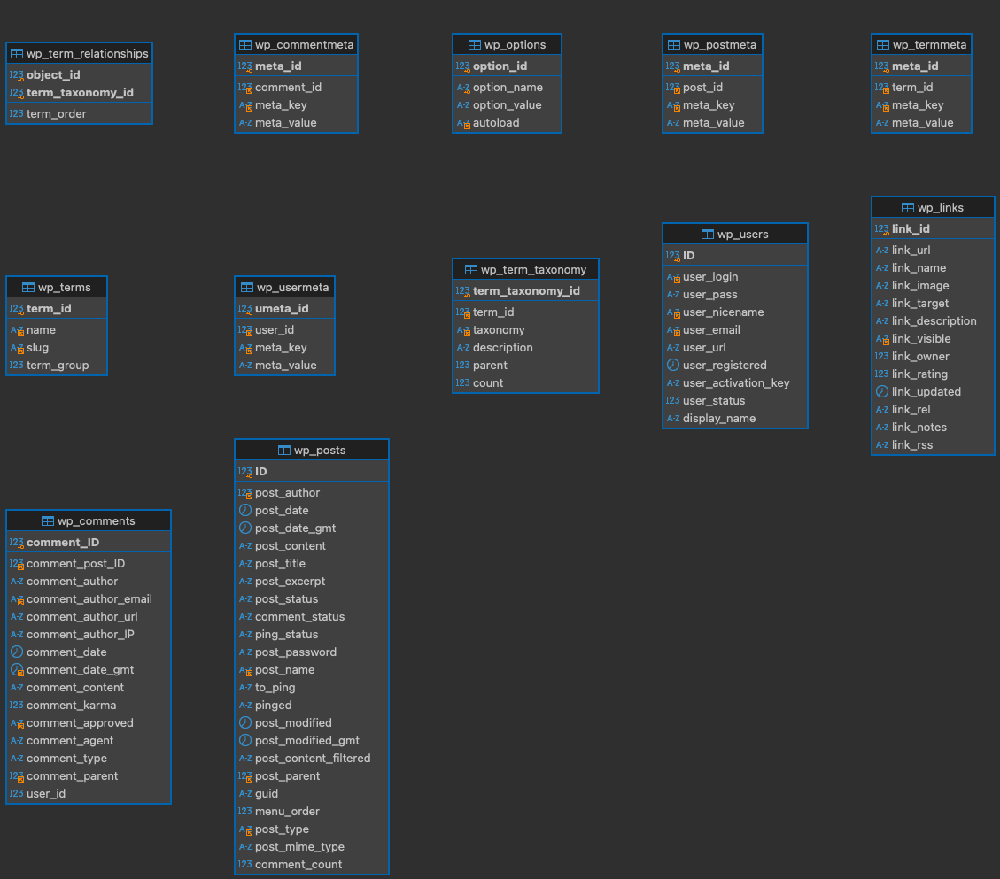

# Stage WordPress

## Première partie
### Qu’est-ce que WordPress ?

WordPress est un logiciel pour la création de site web et qui est plus facile que de faire du HTML.

### WordPress est-il beaucoup utilisé

Oui plus de 850 millions de sites sont fait avec wordpress, cela représente 40% des sites web dans le monde.

### Combien coûte WordPress ?

WordPress est gratuit mais il y a WordPress.com qui peuvent t'héberger votre serveur et c'est de 0 à 38.- par mois. 

### Quelle est la différence entre wordpress.com et wordpress.org

WordPress.com est une plateforme hébergée clé en main, facile à utiliser mais avec des options de personnalisation limitées. WordPress.org offre un contrôle total sur l'hébergement, les thèmes et plugins, mais nécessite de gérer soi-même la maintenance et la sécurité du site.

### je sais ce qu'est un CMS

content management system (un systeme de gestion de contenu) qui est un software qui facilite la création, l'organisation et la publication de contenu.

requis (serveur, serveur web, database)

### Installation de Wordpress

## prerequis

Les prérequis sont une database et un serveur web.

## installation

la procédure que j'ai suivi "https://www.youtube.com/watch?v=dUEpiOJmxBU"

1. Il est nécessaire d'avoir une base de données. Rendez-vous sur https://www.mamp.info/en et cliquez sur "Download".
2. Ensuite, téléchargez WordPress depuis WordPress.org, décompressez-le, puis placez le dossier dans le répertoire "htdocs" de MAMP.
3. lancer MAMP et aller dans preferance et mettez ces settings 
    
4. Ensuite, accédez à http://localhost:8888/phpMyAdmin5/ pour créer une base de données. Cliquez sur l'onglet "Base de données" en haut, puis sur le bouton "Créer". Donnez un nom à votre base de données, définissez un mot de passe dont vous vous souviendrez, et validez la création.
5. Ensuite, accédez à http://localhost:8888/Wordpress/, où vous devrez nommer votre site web et créer un compte pour vous connecter lorsque vous souhaiterez le modifier. Ensuite, entrez le nom de votre base de données, et c’est tout, WordPress sera installé sur votre serveur web.

TODO
 - Savoir ce que signie les acronymes MAMP, LAMP, WAMP et XAMP.

MAMP = Mac Apache - MySQL - PHP
LAMP = Linux, APACHE, MySQL, PHP
WAMP = Windows, Apache, MySQL, and PHP/Perl/Python
XAMPP = cross-platform, Apache, MySQL, PHP and Perl

## Procédure d’installation de WordPress sur une VM distante

1. se connecter à la vm (machine virtuelle) commencé par vous connecté en ssh `ssh ubuntu@ip-adresse`
2. et ensuite mettez tous les systèmes à jour avec `sudo apt update && sudo apt upgrade -y`
      installé LAMP (Linux, Apache, Mysql, php)
3. installé le serveur web Apache avec `sudo apt install apache2`
4. installé le serveur de base de données Mysql avec `sudo apt install mysql-server`
5. sécurisé l'installation avec `sudo mysql_secure_installation`
         Remove anonymous users?                   Yes
         Remove test database and access to it?    Yes
         Reload privilege tables now?              Yes 
6. installé le language de programation php et les dépendances avec `sudo apt install php libapache2-mod-php php-mysql`
       ### Installer WordPress
7. aller dans le répertoire `/var/www/html/` , ensuite télécharger le fichier zip de wordpress en faisant `sudo wget https://wordpress.org/latest.tar.gz`
8. puis dézipé le en faisant `sudo tar -xzvf latest.tar.gz`
9. allé dans le repertoir wordpress en faisant `cd wordpress/`
10. ensuite tapé `sudo mysql` quand vous êtes dans le répertoire wordpress
11. vous devez créer une base de donné en faisant `CREATE DATABASE Wordpressdatabase;`
12. puis créer un user en faisant `CREATE USER 'wpuser'@'localhost' IDENTIFIED BY 'password';`
13. donner tout les privilèges de la base de donné en faisant `GRANT ALL PRIVILEGES ON database_name.* TO 'wpuser'@'localhost';`
`FLUSH PRIVILEGES;'` puis quitté en faisant `EXIT;`
14.  puis copiez et renommez le fichier de configuration `sudo cp wp-config-sample.php  wp-config.php `
15.  puis aller dans wp-config.php `sudo vim wp-config.php`
16.  trouver ces ligne ` define( 'DB_NAME', 'Wordpressdatabase' );
define( 'DB_USER', 'wpuser' );
define( 'DB_PASSWORD', 'password' ); ` et changez en appuyant sur i pour pouvoir modifier changez wordpress par le nom de votre database, wpuser par le nom de l'utilisateur et password par votre mot de pass que vous avez mis dans la consigne 11,12
17.  trouvez les ligne où il y a ça 
`define('NONCE_KEY',        'put your unique phrase here');
define('AUTH_SALT',        'put your unique phrase here');
define('SECURE_AUTH_SALT', 'put your unique phrase here');
define('LOGGED_IN_SALT',   'put your unique phrase here');
define('NONCE_SALT',       'put your unique phrase here');`
et supprimez tout et mettez à la place ce que affiche la page web https://api.wordpress.org/secret-key/1.1/salt/ .

18.   Ensuite enregistrez tout en appuiant sur esc puis :wq puis enter.
19.   Allez là `cd /etc/apache2/sites-available/`.
20.   Ensuite là vous allez modifier le fichier 000-default.conf et allez dedans `sudo vim 000-default.conf`.
21.   Trouvez la ligne `DocumentRoot /var/www/html` et modifiez-la en `DocumentRoot /var/www/html/wordpress`. puis quitté en faisant esc :wq
22.   ensuite relancez apache avec la commande `sudo service apache2 restart`

Plus que à allez sur l'adresse ip de la vm et c'est bon vous avez wordpress sur une vm

### Installation phpmyadmin (interface web graphique pour accéder aux serveur de base de donnée)

1.   quand vous êtes dans la vm tapez la commande `sudo apt install phpmyadmin`
2.   ensuite quand vous devez choisir le serveur web utiliser prenez apache2
3.   une fois l'instalation terminé relancé le serveur web avec la commande `sudo systemctl reload apache2`
4.   aller sur votre site web et rajouter /phpmyadmin à la fin
5.   une fois sur le page de connexion de phpmyadmin connecter vous avec le user mysql qui a tous les accés sur la base de donnée et une fois connecté aller sur votre base de donné et là aller dans operations et là vous devez avoir un bouton pour créer un serveur de base de donné et clickez.
  

## Quatrième partie : développement avec Docker

# Qu'es que un docker ?

Un docker est un containère qui est là pour faire tourné une application dans un espace clos qui peut faire tourné des application et s'assure que l'application tourne dans n'importe quelle environnement et qui utiliser votre noyaux et n'a pas de OS

# Qu'est la différence entre la conteneurisation et la virtualisation ?

la virtualisation est le fait de émulé tout un ordinateur (la carte graphique, la ram, etc) et le os alors que la conteneurisation n'émule pas et utilise le noyaux de l'hôte mais ils ont quand même leur propre bibliothèque et leur propre dépendance comme les VM.
conteneur plus léger que les vm vue pas tout un OS

virtualisation :
1. émule tout un os et un les composants.
2. isolation complète.
3. consomme plus de ressource vue que génére un système d'exploitation complet
4. temps de démarage peuvent être long

conteneurisation :
1. utilise le noyaux de l'hôte.
2. isolation au niveau système d'exploitation.
3. utiliser moins de ressource vue que utilise le même noyaux.
4. temps de démarage rapide

ont les deux leur propre dépendance et bibliothèque.

# Démarer WordPress avec docker.
1. créer un répertoir `mkdir wordpress-docker && cd wordpress-docker
`
2. Créer le fichier docker-compose.yml avec comme contenu :

services:
  wordpress:
    image: arm64v8/wordpress:latest  # Utilisez l'image WordPress pour ARM64
    ports:
      - "8000:80"
    environment:
      WORDPRESS_DB_HOST: db
      WORDPRESS_DB_USER: exampleuser
      WORDPRESS_DB_PASSWORD: examplepass
      WORDPRESS_DB_NAME: exampledb
    volumes:
      - ./wp:/var/www/html

  db:
    image: arm64v8/mariadb:latest  # Utilisez l'image MariaDB pour ARM64
    environment:
      MYSQL_ROOT_PASSWORD: examplepass
      MYSQL_DATABASE: exampledb
      MYSQL_USER: exampleuser
      MYSQL_PASSWORD: examplepass
    volumes:
      - ./db:/var/lib/mysql

volumes:
  wp:
  db:

  Commande pour démarrer Wordpress :

  1. `docker-compose up -d`
  2. `docker ps` (pour voir si le conteneurs est bien lancé)
  3. accéder dans un naviguateur `http://localhost:8000`
  4. `docker-compose down` pour arréter le docker
   
# différence docker file docker et docker compose

docker compose :
  un outil de docker qui permet de définir et gérer des application multi-conteneur
docker file :
  un fichier text contenant des instruction pour automatiser la création d'une image docker

Ports connectent le conteneur à l'extérieur.
Volumes permettent de persister les données.
Variables d'environnement transmettent des configurations dynamiques au conteneur.

pour entrer dans le docker il faut faire `docker exec -it wordpress-docker-wordpress-1 /bin/bash`

Voici ma base de donné 

# Installation plugin sur un volume

aller sur https://wordpress.org/plugins/duplicator/ et télécharger le plugin dublicator puis dézipé le en faisant `unzip (nom du fichier zip)` déplacer le dans le volume wp/wp-content/plugin avec la commande `mv ~/Download/nom du plugin ~/dev/wordpress-docker/wp/wp-content/plugins`pour savoir le nom de votre docker faite `docker ps` puis aller dans votre docker wordpress en faisant `docker exec -it nom-du-docker bash` une fois dedans aller dans `cd /var/www/html/wp-content/plugins` puis intallé WP-CLI `curl -O https://raw.githubusercontent.com/wp-cli/builds/gh-pages/phar/wp-cli.phar`puis  `chmod +x wp-cli.phar` `sudo mv wp-cli.phar /usr/local/bin/wp` puis encore `wp --info --allow-root` Maintenant choisissez le plugin que vous voulez activez `wp plugin list` ensuite activer le avec `wp plugin activate nom-plugin`.

# cinquième partie : déploiement avec Docker (Ops)

## Déploiement en prod

Pour le déploiement en prod il faut commencer par faire un répertoir et un fichier docker-compose.yml `mkdir wordpressDocker` `cd wordpressDocker` `vim docker-compose.yml`
Mettez ça dans le docker-compose.yml clickez sur i pour modifier :
services:
  wordpress:
    image: wordpress:latest  # Utilisez l'image WordPress
    ports:
      - "80:80"
    environment:
      WORDPRESS_DB_HOST: db
      WORDPRESS_DB_USER: exampleuser
      WORDPRESS_DB_PASSWORD: examplepass
      WORDPRESS_DB_NAME: exampledb
    volumes:
      - ./wp:/var/www/html

  db:
    image: mariadb:latest  # Utilisez l'image MariaDB
    ports:
      - 3307:3306
    environment:
      MYSQL_ROOT_PASSWORD: examplepass
      MYSQL_DATABASE: exampledb
      MYSQL_USER: exampleuser
      MYSQL_PASSWORD: examplepass
    volumes:
      - ./db:/var/lib/mysql
    user: "1000:1000"  # Remplacez par l'UID et GID appropriés

Quittez le fichier et sauvegarder en appluiant sur esc puis :wq
Lancer les docker en faisant `docker-compose up -d`
Faites `docker ps` pour verifier si ils sont bien lancé et ensuite mettez l'IP de la vm sur un browser et c'est bon vous avez fais votre déploiement en prod.

### Mon déploiement en production est-il en tout point similaire à celui sur mon ordinateur ?
Oui, le déploiement en production est en tout point similaire.

### Est-ce que les informations importantes du site sont sauvegardées et pourraient être utilisées dans un plan de reprise d’activité (PRA) ?
Non

### Qui pourra accéder à votre site ?
Toute personne étant dans le résaux de l'epfl

### Est-il nécessaire de mettre en place un système d’authentification basé sur celui de l’entreprise ?

pas forcement vue que mon site n'a rien d'important

Qu'est-ce que un SSO  (Single Sign-On) ?
Un SSO (Single Sign-On) est un service d'authentification de session et d'utilisateur qui permet à un utilisateur d'utiliser un ensemble d'informations d'identification (par exemple, nom et mot de passe) pour accéder à plusieurs applications.

# Partie 6 : WordPress@EPFL

## Volumétrie 

### Posez-vous la question de combien de sites sont agrégés ensembles ?
Je pense plus de 100

### Pourquoi pensez-vous que cette façon de faire a été choisie ?
Pour que les serveurs ne satures pas vue que ils y aurait trop de monde sur le même serveur.

# last part

alternative à wordpress ?
Wix
Joopmla
Shopify

wordpress est gratuit mais ils se font de l'argent grace à l'hebergement de site web

voici un site connu qui utiliser wordpress :  le Groupe Renault

avantage de wordpress :
facilitl d'utilisation de personnalisationet d'optimisation.

Inconviennant :
La maintenance WordPress est compliquée.
WordPress peut être lourd.

wordpress est-il un bon choix pour l'epfl ?
Oui vue que on peut faire une tonne de chose avec wordpress un peu tout ce que on veutà

###  Bilan du stage

J'ai bien aimé la partie sur le docker et sur l'installation de wordpress et j'ai appris plein de chose
J'ai moins aimé quand j'étais blocké longtemps sur plein de petit truc du coup je n'avancais pas très vite